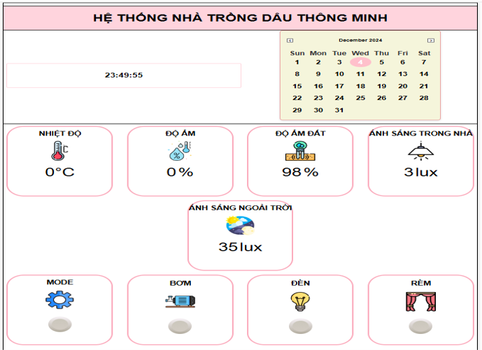
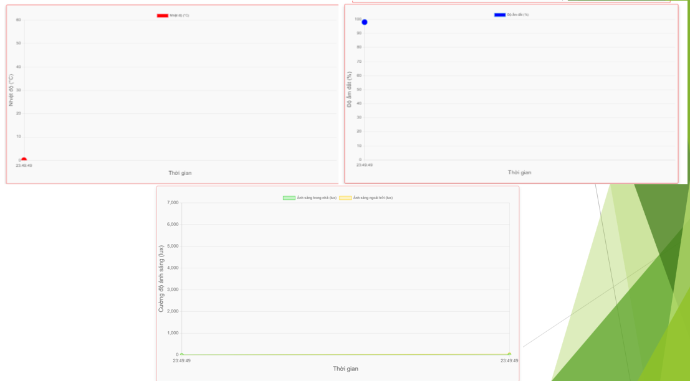
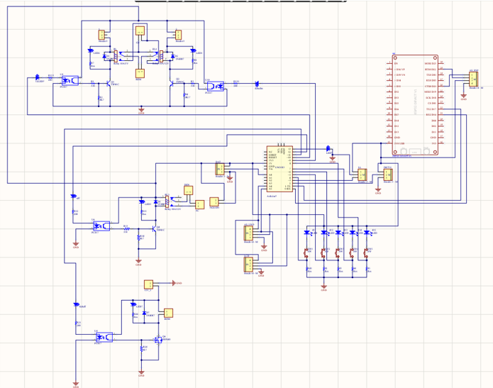
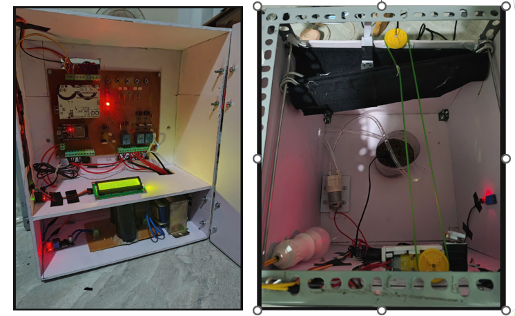
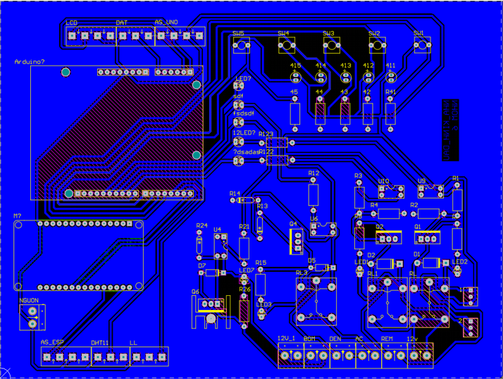

# README

## Mô tả:
- Thiết kế, thi công hệ thống trồng dâu thông minh với sử dụng Arduino UNO, ESP32, DHT11, BH1750, cảm biến độ ẩm đất để điều khiển đèn, bơm, rèm thông qua web và nút nhấn

## Nhiệm vụ cá nhân:
- Code liên kết các cảm biến sau đó truyền lên Firebase và truyền lên website
- Thi công phần cứng
---

## Hình ảnh mạch

### PCB Layout

### PCB Layout (phiên bản khác)

### Schematic

### Mô hình 3D

### 2D Layout

